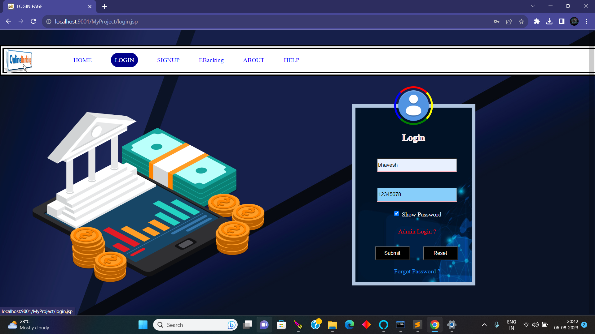
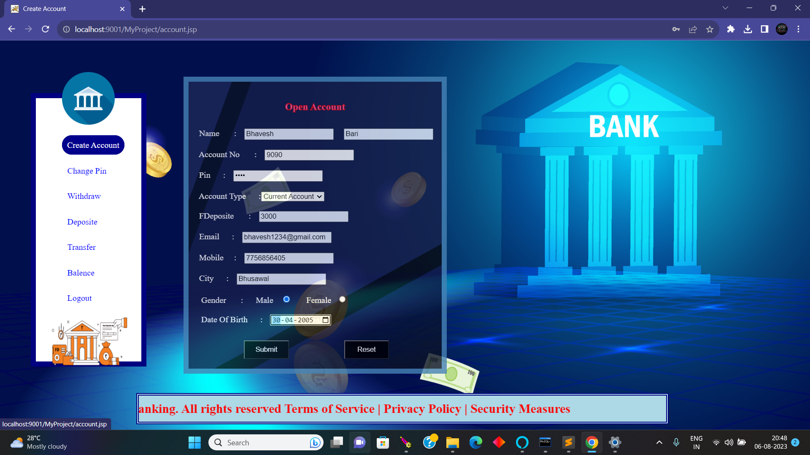
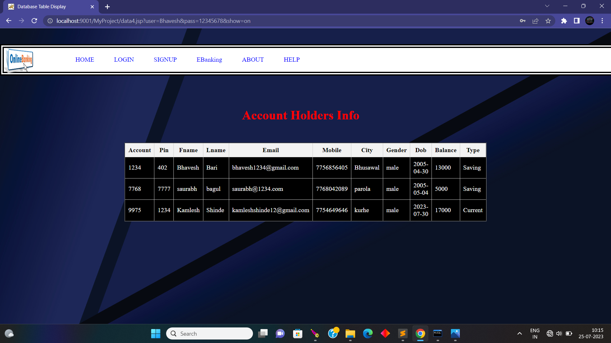

# 💳 eBanking Web App

A simple, secure, and responsive **Virtual Banking Web Application** built using **HTML, CSS, JavaScript (Frontend)** and **JSP, MySQL (Backend)**.

This app simulates real-life banking operations such as account creation, money transfers, deposits, withdrawals, and includes features like **PIN management** and an **Admin Panel** to manage users.

---

## 🚀 Features

- 🏦 Create New Bank Account
- 🔐 Secure Login System
- 💰 Check Account Balance
- 🔄 Transfer Money
- 📥 Deposit Money
- 📤 Withdraw Money
- 🔁 Change PIN
- 🧑‍💼 Admin Panel (view all users, track transactions, manage accounts)

---

## 🖼️ Preview

---

## 🧭 User Flow

1. Users land on the **Home Page**.
2. Click **Login** to access the system.
3. After login:
   - Perform various banking transactions.
   - Option to **Change Transaction PIN** for security.
4. If logged in as **Admin**, access to:
   - View all registered users
   - Monitor transactions
   - Delete or update user accounts

---

## 🛠️ Tech Stack

| Layer      | Technology          |
|------------|---------------------|
| Frontend   | HTML, CSS, JavaScript |
| Backend    | JSP (Java Server Pages) |
| Database   | MySQL               |
| Server     | Apache Tomcat       |

---

Happy showcasing! 🚀

